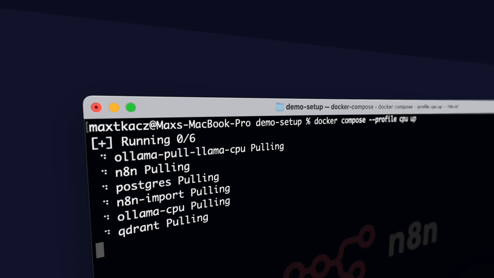

# Self-hosted AI + MCP Starter Kit

A local AI and workflow-automation environment with an integrated [Model Context Protocol](https://modelcontextprotocol.io/) (MCP) server. Forked from [n8n-io/self-hosted-ai-starter-kit](https://github.com/n8n-io/self-hosted-ai-starter-kit) and extended with a dockerized MCP service ([coffee-mate](../first-mcp)) and a ready-to-run AI Agent workflow that consumes it over SSE.



## What's in the box

| Component | Why it's here |
|---|---|
| [**n8n**](https://n8n.io/) | Low-code workflow platform with 400+ integrations and AI/LangChain nodes. |
| [**Ollama**](https://ollama.com/) | Local LLM inference. The init container auto-pulls `llama3.2`. |
| [**Qdrant**](https://qdrant.tech/) | Vector database for embeddings / RAG workflows. |
| [**PostgreSQL**](https://www.postgresql.org/) | Persistent backend for n8n. |
| **coffee-mate-mcp** | TypeScript MCP server (built from the sibling `../first-mcp` repo) exposing coffee-related tools over the SSE transport. Demonstrates n8n ↔ MCP integration. |
| **n8n-import** | One-shot container that imports the demo workflows + credentials on every startup (idempotent by ID). |

### Topology

```text
                    ┌────────────────┐
                    │  PostgreSQL    │  (n8n backend)
                    └──────┬─────────┘
                           │
    ┌──────────────────────┴──────────────────────┐
    │                  n8n  :5678                  │
    │   (depends on: postgres, n8n-import,         │
    │                coffee-mate-mcp healthy)      │
    └─┬──────────────┬──────────────┬──────────────┘
      │              │              │
      ▼              ▼              ▼
 ┌─────────┐   ┌──────────┐   ┌────────────────────┐
 │ Ollama  │   │ Qdrant   │   │ coffee-mate-mcp    │
 │ :11434  │   │ :6333    │   │ :3001  /sse /health│
 └─────────┘   └──────────┘   └────────────────────┘
```

## Prerequisites

- [Docker Desktop](https://www.docker.com/products/docker-desktop/) (or Docker Engine + Compose v2).
- A sibling clone of [`first-mcp`](../first-mcp) at `../first-mcp` relative to this repo. The `coffee-mate-mcp` service is built from that directory.
- For the Azure deployment scripts only: `az` CLI, Bash (Git Bash or WSL on Windows — scripts use `cygpath`), Python with `PyYAML`, and `openssl`.

## Local development

### 1. Configure environment

```bash
cp .env.example .env
```

`.env` is gitignored. The defaults work as-is for local development. Key variables:

| Variable | Purpose |
|---|---|
| `POSTGRES_USER` / `POSTGRES_PASSWORD` / `POSTGRES_DB` | n8n backend Postgres credentials. |
| `N8N_ENCRYPTION_KEY` | Encrypts stored credentials. **See the warning below before changing it.** |
| `N8N_USER_MANAGEMENT_JWT_SECRET` | Signs n8n user-management JWTs. |
| `N8N_DEFAULT_BINARY_DATA_MODE=filesystem` | Stores binary data on disk instead of in Postgres. |
| `OLLAMA_HOST` (commented out) | Override the Ollama URL — used by the Mac/Apple-Silicon flow below. |

> [!WARNING]
> **Do not change `N8N_ENCRYPTION_KEY` before first boot.** The two pre-imported credentials in [`n8n/demo-data/credentials/`](n8n/demo-data/credentials) (Ollama + Qdrant) are encrypted with the upstream demo key (`super-secret-key`) shipped in `.env.example`. Changing the key will leave them undecryptable and you'll have to recreate them in the n8n UI.

### 2. Start the stack

Pick the profile that matches your hardware:

```bash
# CPU only
docker compose --profile cpu up --build

# NVIDIA GPU (see https://github.com/ollama/ollama/blob/main/docs/docker.md)
docker compose --profile gpu-nvidia up --build

# AMD GPU on Linux
docker compose --profile gpu-amd up --build
```

Use `--build` whenever the `../first-mcp` source changes (rebuilds the `coffee-mate-mcp` image). Add `-d` to run detached.

#### Mac / Apple Silicon

Docker Desktop on macOS cannot expose the GPU. Either run with `--profile cpu`, or run Ollama natively on the host and point n8n at it:

```bash
# In .env
OLLAMA_HOST=host.docker.internal:11434

# Then start without an Ollama profile (the ollama-* services stay disabled)
docker compose up --build
```

### 3. First-boot wait

The `ollama-pull-llama-*` init container downloads `llama3.2` on first boot. Watch progress with:

```bash
docker logs -f ollama-pull-llama
```

Workflow imports run automatically via the `n8n-import` one-shot container before n8n itself starts.

### 4. Configure the MCP credential (one-time, via UI)

MCP / SSE credentials cannot be pre-encrypted in JSON, so they're not bundled. Create one from the n8n UI:

1. Open <http://localhost:5678/> and complete the first-time owner setup.
2. Open the **Coffee MCP Agent** workflow at <http://localhost:5678/workflow/mCpC0ffeeMateW0rk>.
3. Click the **MCP Client Tool** node.
4. Create a new credential with **SSE endpoint** = `http://coffee-mate-mcp:3001/sse` and **Authentication** = `None`.
5. Save the credential and the workflow.
6. Click **Chat** and try: *"What coffees do you have?"*

> [!NOTE]
> The URLs above target the local Compose stack. For the Azure deployment, see [Post-deployment URLs](#post-deployment-urls) — the n8n UI lives at the ACA FQDN and the MCP server is at a different host **and** path (`/mcp`, not `/sse`).

## Workflows

Both files live under [n8n/demo-data/workflows/](n8n/demo-data/workflows) and are auto-imported on every startup (idempotent by `id`).

| ID | Name | URL | Pipeline |
|---|---|---|---|
| `srOnR8PAY3u4RSwb` | Demo workflow | <http://localhost:5678/workflow/srOnR8PAY3u4RSwb> | Chat Trigger → Basic LLM Chain ← Ollama Chat Model (`llama3.2:latest`) |
| `mCpC0ffeeMateW0rk` | Coffee MCP Agent | <http://localhost:5678/workflow/mCpC0ffeeMateW0rk> | Chat Trigger → AI Agent ← Ollama Chat Model + MCP Client Tool (SSE → `coffee-mate-mcp:3001/sse`) |

## Repository layout

```text
.
├── docker-compose.yml          # All services (postgres, n8n, n8n-import, ollama×3 profiles, qdrant, coffee-mate-mcp)
├── .env.example                # Template — copy to .env (gitignored)
├── AGENTS.md                   # Conventions and contributor/agent guidance
├── CONTRIBUTING.md             # Upstream vision & contribution guidelines
├── assets/
│   └── n8n-demo.gif
├── shared/                     # Bind-mounted to /data/shared inside n8n
├── n8n/demo-data/
│   ├── workflows/              # Auto-imported by n8n-import on every startup
│   │   ├── srOnR8PAY3u4RSwb.json    # Demo workflow
│   │   └── mCpC0ffeeMateW0rk.json   # Coffee MCP Agent
│   └── credentials/            # Pre-encrypted with the .env.example demo key
│       ├── xHuYe0MDGOs9IpBW.json    # Local Ollama service
│       └── sFfERYppMeBnFNeA.json    # Local Qdrant Api database
└── infra/                      # Azure Bicep IaC (deployed via .github/workflows/)
```

## Service reference

| Service | Container | Port | Notes |
|---|---|---|---|
| n8n | `n8n` | `5678` | Web UI + API. |
| coffee-mate-mcp | `coffee-mate-mcp` | `3001` | `/sse` MCP endpoint, `/health` for the healthcheck. Built from `../first-mcp`. |
| Ollama | `ollama` | `11434` | One per profile (`cpu` / `gpu-nvidia` / `gpu-amd`). |
| Qdrant | `qdrant` | `6333` | REST + gRPC. |
| PostgreSQL | `postgres` | — | Internal only on the `demo` network. |
| n8n-import | `n8n-import` | — | One-shot importer; runs to completion before `n8n` starts. |
| ollama-pull-llama | `ollama-pull-llama` | — | One-shot model pull (`llama3.2`). |

## Azure deployment (Bicep + GitHub Actions)

The Azure side of this stack is deployed declaratively from [infra/](infra/) using Bicep, driven by GitHub Actions workflows under [.github/workflows/](.github/workflows/). OIDC + a user-assigned managed identity replace static service-principal secrets. See [infra/MIGRATION-PLAN.md](infra/MIGRATION-PLAN.md) for the full plan and phase status, and [infra/bootstrap.bicep](infra/bootstrap.bicep) (deployed once at subscription scope) for the one-time bootstrap of identities, federated credentials, and Key Vault.

### Target topology

| Resource | Name (default) |
|---|---|
| Resource group (workload) | `rg-n8n-01-dev` |
| Region | `southafricanorth` |
| ACA managed environment (shared) | `cae-mcp-01-dev-southafricanorth` (in `rg-mcp-01-dev-southafricanorth`) |
| n8n Container App | `ca-n8n-01-dev` |
| Ollama Container App | `ca-ollama-01-dev` |
| Qdrant Container App | `ca-qdrant-01-dev` |
| Import job | `caj-n8n-import-01-dev` |
| Ollama pull job | `caj-ollama-pull-01-dev` |
| Postgres Flexible Server | `psql-n8n-01-dev-26070` (Burstable B1ms, PG 16) |
| Storage account | `stn8n01dev2262613750` |
| Azure Files shares | `n8n-data`, `n8n-shared`, `qdrant-data`, `ollama-models`, `n8n-demo-data` |
| Key Vault | `kv-n8n-01-dev-26070` |
| Deploy MI | `id-n8n-deploy-dev` (used by GHA via OIDC) |
| Runtime MI | `id-n8n-runtime-dev` (used by Container Apps for KV secret refs) |

### One-time bootstrap

The bootstrap layer (deploy + runtime managed identities, OIDC federated credentials, custom CAE-storage role, Key Vault) is deployed once at subscription scope via `az deployment sub create -l southafricanorth -f infra/bootstrap.bicep -p infra/bootstrap.dev.bicepparam`. After it runs, register the four required GitHub `dev` environment secrets (`AZURE_CLIENT_ID`, `AZURE_TENANT_ID`, `AZURE_SUBSCRIPTION_ID`, `AZURE_KEY_VAULT_NAME`) — values printed as bootstrap outputs.

### How to deploy

| Trigger | Workflow | What runs |
|---|---|---|
| PR to `main` touching `infra/**` or `n8n/demo-data/**` | [`infra-pr.yml`](.github/workflows/infra-pr.yml) | `az bicep build` + `az bicep lint` + `az deployment group what-if`; what-if diff posted as a sticky PR comment. **Read-only.** |
| Push to `main` (same paths) or manual `workflow_dispatch` | [`infra-deploy.yml`](.github/workflows/infra-deploy.yml) | Bicep deploy → demo-data upload → import job (poll) → Ollama pull job (poll, ~20 min cold) → `curl /healthz` smoke. |
| Manual demo-data refresh | [`_demo-data-upload.yml`](.github/workflows/_demo-data-upload.yml) | Standalone reusable upload (workflows or credentials). |
| Mondays 14:00 UTC (cron) or manual | [`infra-drift.yml`](.github/workflows/infra-drift.yml) | `az deployment group what-if` against `main`; fails the run if any **Modify** or **Delete** delta exists (Azure changed out-of-band). Full diff posted as Job Summary. |

All workflows authenticate via OIDC against the `id-n8n-deploy-dev` MI; no long-lived secrets.

### Surviving manual steps

The `n8n-encryption-key` is unique to each KV; once the n8n DB has credentials encrypted under one key, switching keys invalidates them. After the **first** successful deploy (and after any `n8n-encryption-key` rotation), recreate the two non-importable credentials in the n8n UI:

1. **Local Ollama service** (`ollamaApi`, ID `xHuYe0MDGOs9IpBW`) — Base URL: `http://ca-ollama-01-dev`.
2. **Local Qdrant Api database** (`qdrantApi`, ID `sFfERYppMeBnFNeA`) — URL: `http://ca-qdrant-01-dev`.
3. **MCP Client Tool credential** — n8n's MCP credential type cannot be pre-encrypted in JSON; configure it through the UI. Endpoint differs from local Compose:

   | Environment | Endpoint |
   |---|---|
   | Local Compose | `http://coffee-mate-mcp:3001/sse` |
   | Azure | `https://ca-mcp-01-dev-southafricanorth.greengrass-f377fe8c.southafricanorth.azurecontainerapps.io/mcp` (note `/mcp`, not `/sse`) |

### Secrets

- KV-managed (rotated via `az keyvault secret set`, picked up on next revision restart): `n8n-encryption-key`, `n8n-jwt-secret`, `pg-admin-password`.
- GitHub-managed (the OIDC client ID + tenant + subscription IDs): set on the `dev` environment.
- No values committed to the repo. `.env` is gitignored.

### Post-deployment URLs

| Resource | URL |
|---|---|
| n8n UI | `https://ca-n8n-01-dev.greengrass-f377fe8c.southafricanorth.azurecontainerapps.io` |
| Ollama (CAE-internal) | `http://ca-ollama-01-dev` |
| Qdrant (CAE-internal) | `http://ca-qdrant-01-dev` |

## Tips & tricks

### Accessing local files

`./shared` is bind-mounted to `/data/shared` inside the n8n container. Use that path in nodes such as:

- [Read/Write Files from Disk](https://docs.n8n.io/integrations/builtin/core-nodes/n8n-nodes-base.filesreadwrite/)
- [Local File Trigger](https://docs.n8n.io/integrations/builtin/core-nodes/n8n-nodes-base.localfiletrigger/)
- [Execute Command](https://docs.n8n.io/integrations/builtin/core-nodes/n8n-nodes-base.executecommand/)

### Full reset

```bash
docker compose --profile cpu down -v
docker compose --profile cpu up --build
```

`-v` removes the `n8n_storage`, `postgres_storage`, `ollama_storage`, and `qdrant_storage` volumes.

## Recommended reading

- [AI agents for developers: from theory to practice with n8n](https://blog.n8n.io/ai-agents/)
- [Tutorial: Build an AI workflow in n8n](https://docs.n8n.io/advanced-ai/intro-tutorial/)
- [LangChain concepts in n8n](https://docs.n8n.io/advanced-ai/langchain/langchain-n8n/)
- [Demonstration of key differences between agents and chains](https://docs.n8n.io/advanced-ai/examples/agent-chain-comparison/)
- [Model Context Protocol specification](https://modelcontextprotocol.io/)

## License

Apache License 2.0 — see [LICENSE](LICENSE).

## Support

Join the conversation in the [n8n Forum](https://community.n8n.io/).
